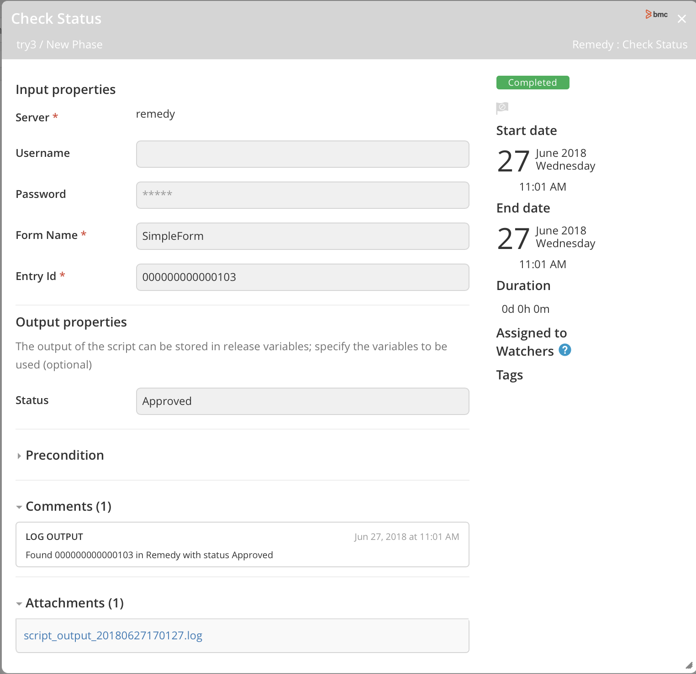
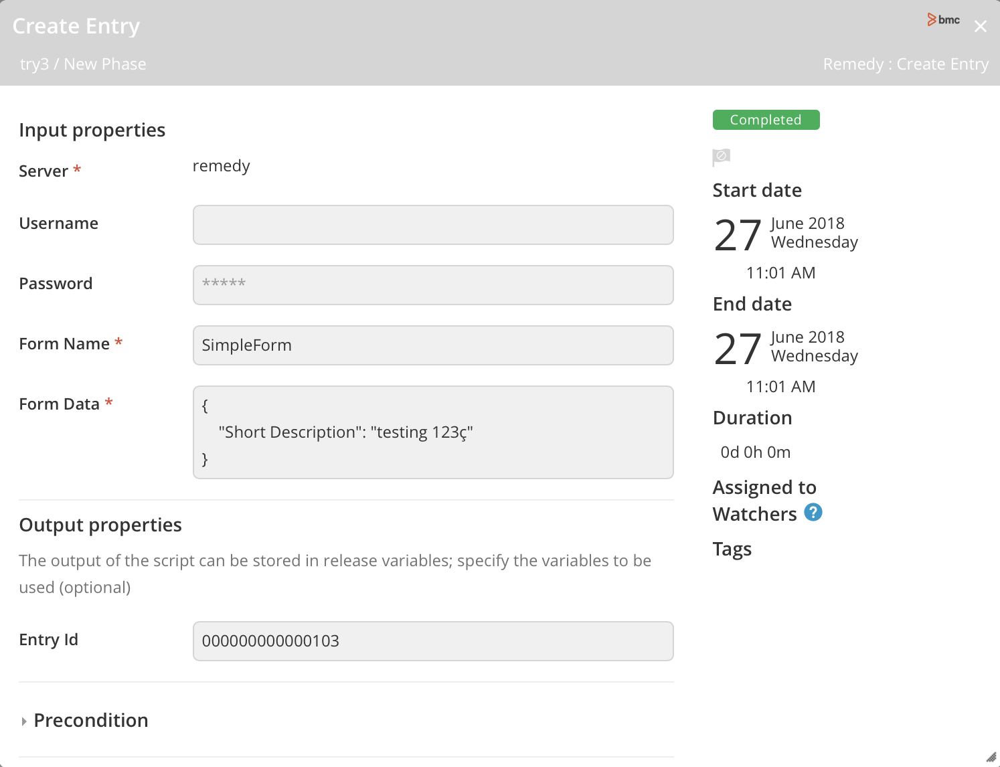
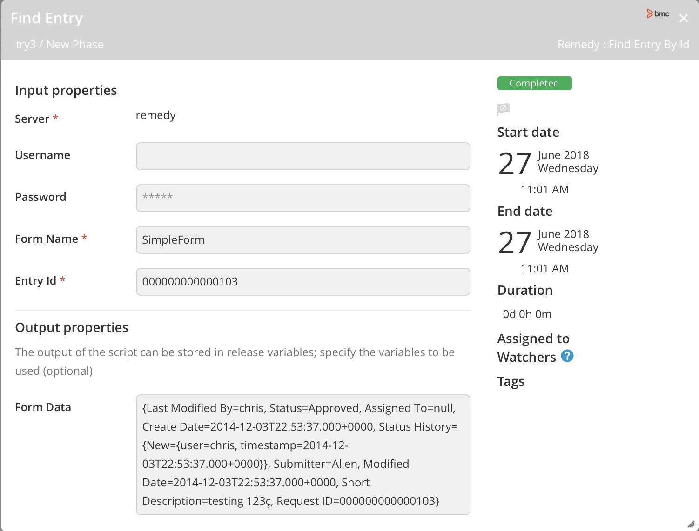
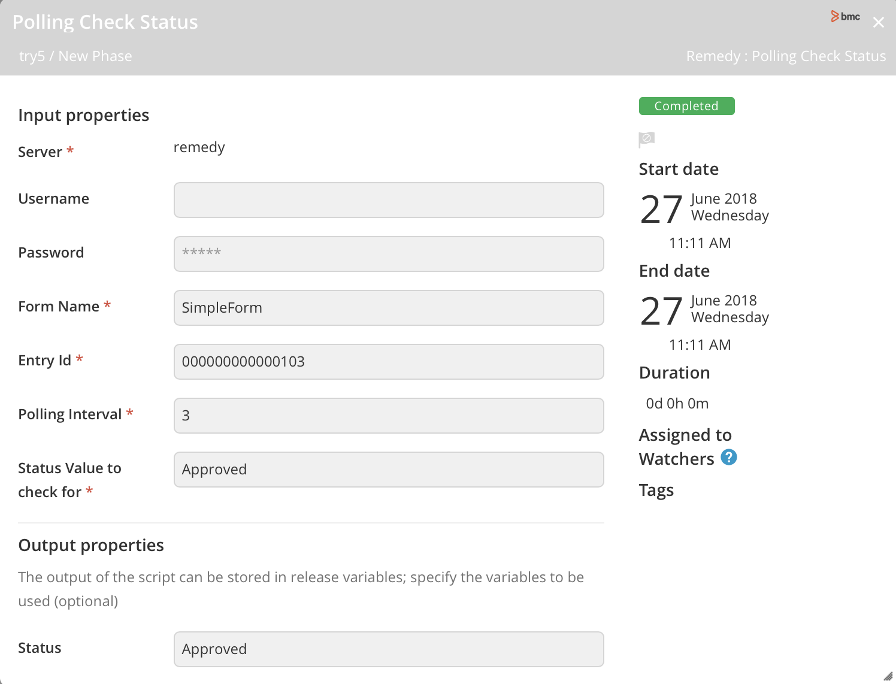
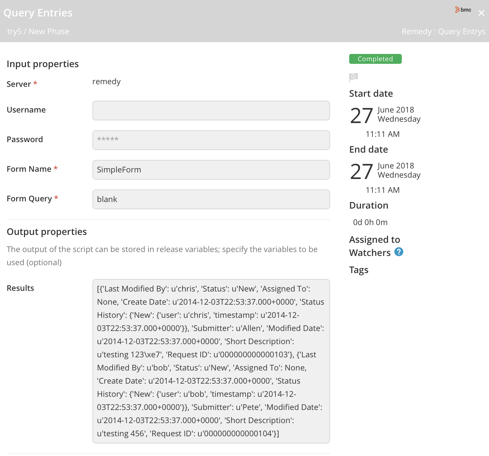
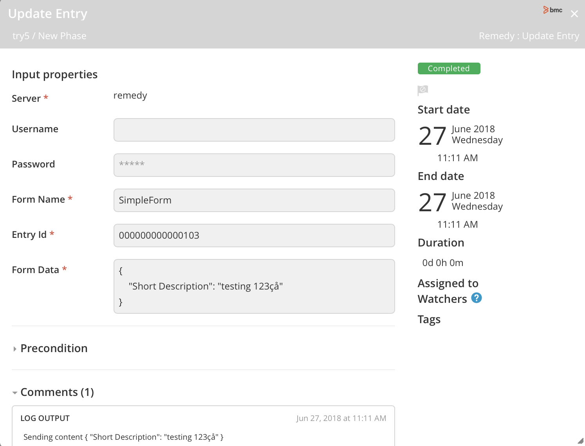

# XL Release Remedy plugin

## Preface ##

This document describes the functionality provided by the XL Release Remedy plugin. The tasks implemented by this plugin can create, update and query entries on a Remedy Server via the server's REST API.

See the **[XL Release Documentation](https://docs.xebialabs.com/xl-release/)** for background information on XL Release concepts.

## Overview ##

The XL Release Remedy plugin enables you interact with BMC Remedy services.

## Tasks

## Requirements ##

* **XL Release** 7.x+

## Installation ##

* Download the latest plugin version JAR from the `releases`.
* Follow the guide [here](https://docs.xebialabs.com/xl-release/how-to/install-or-remove-xl-release-plugins.html)
